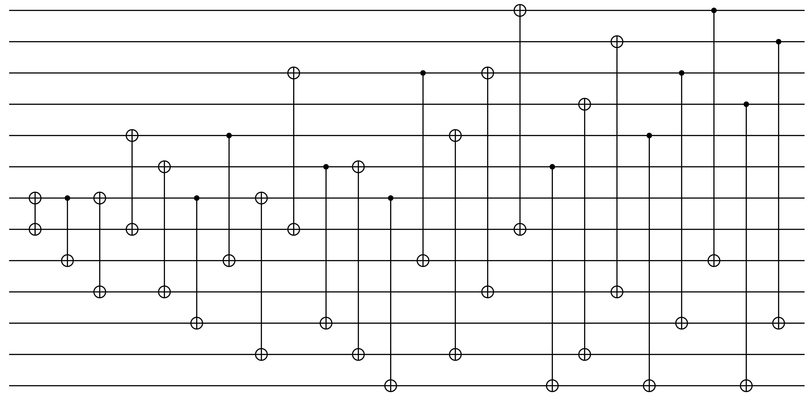

# CircuitCompilation2xn
CircuitCompilation2xn offers some tools to manipulate syndrome extracting circuits for better use on 2xn quantum dot hardwares. For more information please refer to our [paper](https://arxiv.org/abs/2501.09061) , and if one would desire to cite this tool, please cite the paper.

## Tutorial
First, we state that this work is closely integrated with [QuantumClifford.jl](https://github.com/QuantumSavory/QuantumClifford.jl) 

To begin, we will need either a parity check matrix (or stabilizer tableau), or a `Vector{QuantumClifford.AbstractOperation}` containing the syndrome extracting circuit. Currently, we enforce the constraint that syndrome extracting circuit will always be of a form where the two qubit gates act one one qubit in the data qubit region and one in the ancilla region (i.e. there are two qubit gates that go between data or ancilla qubits). 

`QuantumClifford.jl` as of present (v0.10.0), contains two functions for generating syndrome extracting circuits for any provided stabilizer tableau, one for naive syndrome extraction (a single ancillary qubit is used per parity check), and one for Shor-style fault tolerant syndrome extraction (each parity check requires a w-body GHZ state, where w is weight of the parity check at hand). This is shown in Figure 3, of the [paper](https://arxiv.org/abs/2501.09061):


From here on, this tutorial will contain a few examples, divided into sections below:
- Naive syndrome circuit compilation example
- Shor syndrome circuit compilation example
- Simulation example

### Naive syndrome circuit compilation example
First we will need a error correction code, and while any will do, let's use one that's already defined within `QuantumClifford.jl`, and is quite pedagogical. Furthermore, one might want to consider the X and Z checks seperately to guarantee commutativity, however for this first example and for simplicity, we will consider them together. (This is addressed later in this README)

```
using QuantumClifford
using QuantumClifford.ECC

code = Steane7()
scirc, _ = QuantumClifford.ECC.naive_syndrome_circuit(code)
```

`scirc` will now be in the style of the required input to the functions of `CircuitCompilation2xn`:
```
julia> scirc
30-element Vector{QuantumClifford.AbstractOperation}:
 sXCX(4,8)
 sXCX(5,8)
 sXCX(6,8)
 sXCX(7,8)
 sMRZ(8, 1)
 sXCX(2,9)
 sXCX(3,9)
 sXCX(6,9)
 sXCX(7,9)
 sMRZ(9, 2)
 sXCX(1,10)
 sXCX(3,10)
 sXCX(5,10)
 sXCX(7,10)
 sMRZ(10, 3)
 sCNOT(4,11)
 sCNOT(5,11)
 sCNOT(6,11)
 sCNOT(7,11)
 sMRZ(11, 4)
 sCNOT(2,12)
 sCNOT(3,12)
 sCNOT(6,12)
 sCNOT(7,12)
 sMRZ(12, 5)
 sCNOT(1,13)
 sCNOT(3,13)
 sCNOT(5,13)
 sCNOT(7,13)
 sMRZ(13, 6)
```

Visualizing this with [Quantikz.jl](https://github.com/QuantumSavory/Quantikz.jl):


Now we can use CircuitCompilation2xn to compile this circuit in different ways, as well as to calculate the number of shifts it would take to run in its current form.

```
using CircuitCompilation2xn
non_mz, mz = CircuitCompilation2xn.two_qubit_sieve(scirc)
```
`two_qubit_sieve` splits the input circuit into two-qubit gates, and non two-quibit gates, which for both types of syndrome extraction currently available in `QuantumClifford.jl`, will just consist two qubit gates and measurements. If cat states are used in the syndrome extracting circuit, those will need to be removed prior to using `two_qubit_sieve`. This function now gives us with only the two qubit gates in the first item returned, in this example `non_mz`:


The `calculate_shifts` function is used to evaluate the required shuttling operations required carry out the provided circuit. It returns a vector of vectors, each corresponding to a subcircuit that can be run in parallel. The length of this is then the number of shuttles required. Unsurprisingly, not doing any compilation leads to a requirement of quite a few shuttle operations:
```
julia> CircuitCompilation2xn.calculate_shifts(non_mz)
24-element Vector{Vector{QuantumClifford.AbstractOperation}}:
 [sXCX(4,8)]
 [sXCX(5,8)]
 [sXCX(6,8)]
 [sXCX(7,8)]
 [sXCX(2,9)]
 [sXCX(3,9)]
 [sXCX(6,9)]
 [sXCX(7,9)]
 [sXCX(1,10)]
 [sXCX(3,10)]
 [sXCX(5,10)]
 [sXCX(7,10)]
 [sCNOT(4,11)]
 [sCNOT(5,11)]
 [sCNOT(6,11)]
 [sCNOT(7,11)]
 [sCNOT(2,12)]
 [sCNOT(3,12)]
 [sCNOT(6,12)]
 [sCNOT(7,12)]
 [sCNOT(1,13)]
 [sCNOT(3,13)]
 [sCNOT(5,13)]
 [sCNOT(7,13)]
```

We can trivially reduce this number by sorting the gates by their $\delta$ values as described in our [paper](https://arxiv.org/abs/2501.09061). 

```
julia> gate_shuffled_circ = CircuitCompilation2xn.gate_shuffle_circ(non_mz)
julia> CircuitCompilation2xn.calculate_shifts(gate_shuffled_circ)
11-element Vector{Vector{QuantumClifford.AbstractOperation}}:
 [sXCX(7,8)]
 [sXCX(6,8), sXCX(7,9)]
 [sXCX(5,8), sXCX(6,9), sXCX(7,10)]
 [sXCX(4,8), sCNOT(7,11)]
 [sXCX(5,10), sCNOT(6,11), sCNOT(7,12)]
 [sXCX(3,9), sCNOT(5,11), sCNOT(6,12), sCNOT(7,13)]
 [sXCX(2,9), sXCX(3,10), sCNOT(4,11)]
 [sCNOT(5,13)]
 [sXCX(1,10), sCNOT(3,12)]
 [sCNOT(2,12), sCNOT(3,13)]
 [sCNOT(1,13)]
```

This circuit visualized with Quantikz:


To further compile this, we can use the block packing heuristics also called AHR in our [paper](https://arxiv.org/abs/2501.09061)

```
julia> ahr_circ, ahr_order = CircuitCompilation2xn.ancil_reindex_pipeline(non_mz);
julia> CircuitCompilation2xn.calculate_shifts(ahr_circ)
9-element Vector{Vector{QuantumClifford.AbstractOperation}}:
 [sXCX(7,8)]
 [sCNOT(7,9)]
 [sXCX(7,10), sXCX(5,8)]
 [sXCX(6,10), sCNOT(7,11), sCNOT(5,9)]
 [sXCX(7,12), sXCX(3,8), sCNOT(6,11)]
 [sXCX(6,12), sCNOT(7,13), sCNOT(3,9)]
 [sXCX(5,12), sXCX(3,10), sXCX(1,8), sCNOT(6,13)]
 [sXCX(4,12), sXCX(2,10), sCNOT(5,13), sCNOT(3,11), sCNOT(1,9)]
 [sCNOT(4,13), sCNOT(2,11)]
 julia> ahr_circ
```



The `ancil_reindex_pipeline` function returns first the reindexed circuit, and second a dictionary which was used to reindex the circuit. The function itself tries a variety of heurisitics and then picks the best one. Gate shuffling is also automatically applied. In the naive syndrome case, we won't need to relabel the measurement circuit (as they are all Z measurements), but for Shor syndrome extraction these dicitonaries will be needed to relabel the cat state generation. For thoroughness this is how one would generally finish up piecing the reindexed circuit back together:

```
julia> new_mz = CircuitCompilation2xn.reindex_by_dict(mz, ahr_order)
julia> vcat(ahr_circ, new_mz)
```


Another thing to note: `ancil_reindex_pipeline`  applies the `two_qubit_sieve` function automatically, and then reindexes the qubits in the non-qubit portions as well, so we just as well could have done:

```
julia> scirc, _ = QuantumClifford.ECC.naive_syndrome_circuit(code);
julia> code = Steane7();
julia> ahr, _ = CircuitCompilation2xn.ancil_reindex_pipeline(scirc);
julia> ahr
```

While not mentioned in the paper, for in practice it never affected Shor-style syndrome extraction, on naive syndrome circuit one can instead fix the ancilla and reindex the data qubits instead to achieve a reduction in shuttles with the same simple heuristic techniques：

```
julia> code = Steane7();
julia> scirc, _ = QuantumClifford.ECC.naive_syndrome_circuit(code);
julia> data_comp_circ, data_order = CircuitCompilation2xn.data_ancil_reindex(scirc, numQubits);
julia> CircuitCompilation2xn.calculate_shifts(data_comp_circ)
7-element Vector{Vector{QuantumClifford.AbstractOperation}}:
 [sXCX(4,8), sXCX(6,10)]
 [sCNOT(4,9), sCNOT(6,11), sXCX(3,8), sXCX(7,12), sXCX(5,10)]
 [sXCX(4,10), sXCX(6,12), sCNOT(3,9), sCNOT(7,13), sXCX(2,8), sCNOT(5,11)]
 [sCNOT(4,11), sCNOT(6,13), sCNOT(2,9), sXCX(1,8)]
 [sXCX(4,12), sXCX(2,10), sCNOT(1,9)]
 [sCNOT(4,13), sXCX(3,12), sCNOT(2,11)]
 [sCNOT(3,13)]
julia> data_comp_circ
```


Note that if using an encoding circuit for simulation, that will also need to be reindexed if you reindex the data qubits:
```
julia> ecirc = QuantumClifford.ECC.naive_encoding_circuit(code)
julia> new_ecirc = CircuitCompilation2xn.reindex_by_dict(ecirc, data_order)
```

## Shor syndrome circuit compilation example
We devote a decent portion of our paper trying to leverage the structure of how the Shor-style syndrome extraction interact with the compilation primitives we laid out before. Furthermore, we develop a heurisitic specific to these circuit. First, like before we generate the circuits using functions from `QuantumClifford.jl`

```
using QuantumClifford
using QuantumClifford.ECC
code = Steane7();
cat, scirc, _ = QuantumClifford.ECC.shor_syndrome_circuit(code);
vcat(cat, scirc)
```


`cat` is the circuit for constructing the cat state needed for Shor syndrome extraction, and `scirc` contains the two qubit gates and measurement. We can now reindex `scirc`  as in the naive case, we will simply need to reorder the cat state generation circuit to match. Moreover, for Shor syndrome circuits, we reccomend using our heuristic specific to these types of circuits, refered to Shor Syndrome Specialized Compilation (SSSC) in the paper. Below we will only look at the X checks so that circuit can be visualized by `Quantikz.jl`. The `shor_cat` variable also demonstrates how to use the returned dictionary to reindex other parts of the error-correction circuit.
```
code = Steane7()
checks = parity_checks(code)
x_checks = checks[1:3]
cat, scirc, _ = QuantumClifford.ECC.shor_syndrome_circuit(x_checks)
shor_new_circuit, shor_order = CircuitCompilation2xn.ancil_reindex_pipeline_shor_syndrome(scirc)
shor_cat = CircuitCompilation2xn.reindex_by_dict(cat, shor_order)
vcat(shor_cat, shor_new_circuit)
```


In this case, compiling reduces the number of shuttles from 7 to 3:
```
julia> CircuitCompilation2xn.calculate_shifts(scirc)
7-element Vector{Vector{QuantumClifford.AbstractOperation}}:
 [sXCZ(4,8), sXCZ(5,9), sXCZ(6,10), sXCZ(7,11)]
 [sXCZ(2,12), sXCZ(3,13)]
 [sXCZ(6,14), sXCZ(7,15)]
 [sXCZ(1,16)]
 [sXCZ(3,17)]
 [sXCZ(5,18)]
 [sXCZ(7,19)]

julia> CircuitCompilation2xn.calculate_shifts(shor_new_circuit)
3-element Vector{Vector{QuantumClifford.AbstractOperation}}:
 [sXCZ(4,11), sXCZ(5,12), sXCZ(6,13), sXCZ(7,14), sXCZ(2,9), sXCZ(3,10), sXCZ(1,8)]
 [sXCZ(7,16)]
 [sXCZ(6,18), sXCZ(7,19), sXCZ(3,15), sXCZ(5,17)]
```
## Nice to have functions for quick data collection
If one is only interested in obtaining the number of shuttling operations required for different levels of compilation (and doesn't need the compiled circuit) for a given syndrome circuit, a function is provided for this for bot Shor and naive syndrome extraction. The last two numbers are related to the minimum number of shuttles, if allowing blank qubits in the array.  This number wasn't optimized, and is computed by just counting the number of gaps in the chains. Refer to the paper for more information on this. 

Shor syndrome circuit:
```
julia> code = Steane7();
julia> cat, scirc, _ = QuantumClifford.ECC.shor_syndrome_circuit(code);
julia> CircuitCompilation2xn.shorNumbers(scirc)
Uncompiled: 14
Gate Shuffled: 14
Ancil Heuristic: 7
SSSC: 6
Or could do in 6 shifts, using  at most 2 blank qubits.
6-element Vector{Any}:
 14
 14
  7
  6
  6
  2
```

Naive circuit: 
```
julia> code = Steane7();
julia> scirc, _ = QuantumClifford.ECC.naive_syndrome_circuit(code);
julia> num_qubits = code_n(code)+code_s(code)
13
julia> CircuitCompilation2xn.comp_numbers(scirc, num_qubits)
4-element Vector{Any}:
 24
 11
  9
  7
```
24 is the uncompiled number of shuttles, 11 is gate shuffled, 9 is ancillary reindexing, and 7 is ancillary + data reindexing.

## How to do simulations with this software
`src/plotting_CC2xn.jl` contains some lines at the bottom that can be commented or uncommented to generate various plots that appear in the paper. For example
```
f_Steane = my_plot_both_synd(Steane7(), TableDecoder(Steane7()))
f_t3 = plot_for_paper_figure(Toric(3, 3), PyMatchingDecoder(Toric(3, 3)), name="Toric 3x3")
```
`f_Steane` will be the plot containing the 4 different physical vs logical error plots from the paper's appendix, `f_t3` generates a single plot. 
More details coming soon...
## Further information
Please contact Anthony Micciche (email listed in the paper) if you have any issues running this software.
